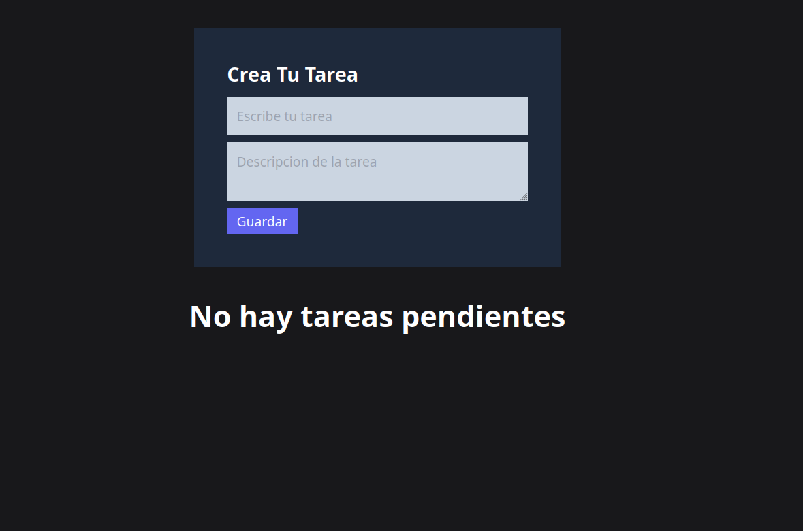
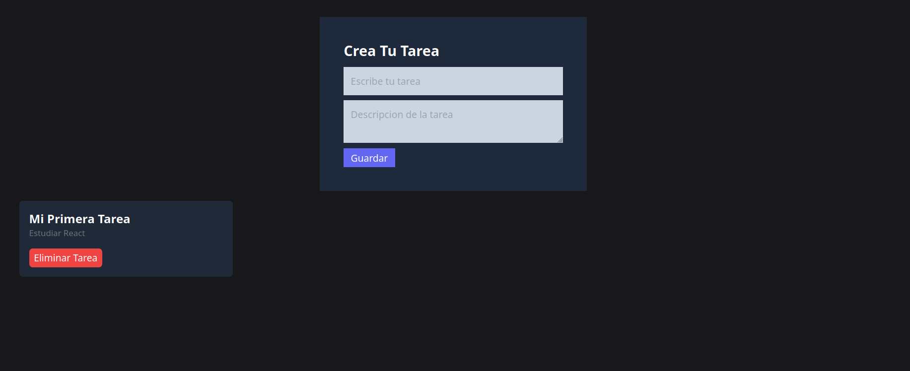
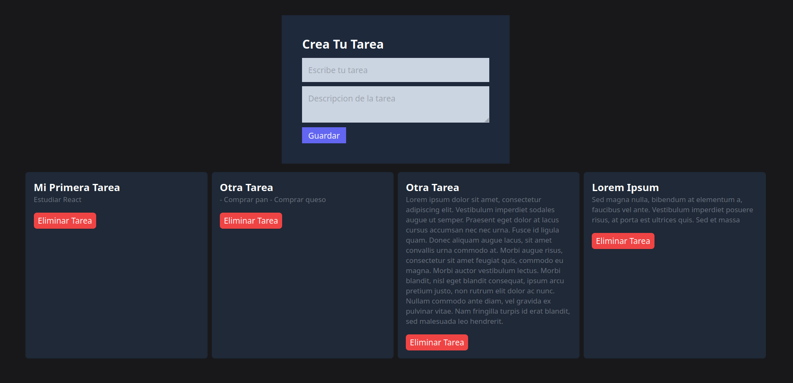
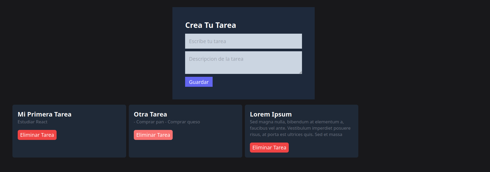

# React To-Do App

This is a simple To-Do List application built with React and Vite.js. The app allows users to create, save, and delete tasks as needed.

## Features

- **Task Creation:** Easily add new tasks to the list.
- **Task Management:** Save completed tasks or delete them when done.
- **Simple Interface:** Clean and intuitive design for easy task management.

## Technologies Used

- **React:** Frontend library for building the user interface.
- **Vite.js:** Fast and opinionated web dev build tool that serves your code via native ES Module imports during development.

## Usage

To run the application:

1. Clone or download the repository.
2. Install dependencies using `npm install` or `yarn install`.
3. Start the development server using `npm run dev` or `yarn dev`.
4. Access the app in your browser at the provided URL.

## How It Works

The app uses React components to manage and display tasks. Vite.js is employed for quick development and efficient bundling of assets.

The main functionalities include creating tasks, marking them as completed, and deleting tasks from the list.

## Preview

<!-- ## Demo

_Insert a link to a live demo of the To-Do List app (if available)_

## Structure -->

